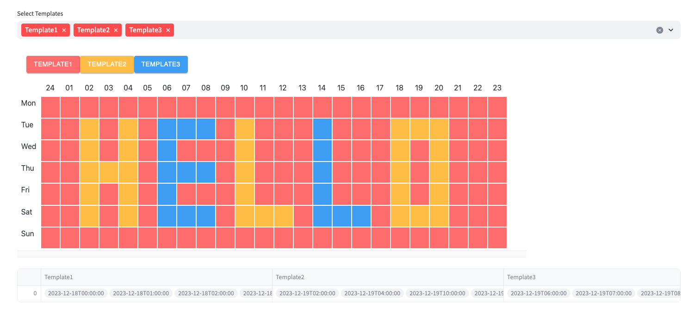

# streamlit-week-calendar

Streamlit component that allows you to use react-schedule-selector


## Installation instructions

```sh
pip install streamlit-week-calendar
```

## Usage instructions
The setting period is from December 18th to 24rd.

```python
import streamlit as st
import pandas as pd
import json
from streamlit_week_calendar import week_calendar

data = {
    'Template1': {'Mon': ['08:00', '24:00', '01:00', '02:00', '03:00', '04:00', '05:00', '06:00', '07:00', '08:00', '09:00', '10:00', '11:00', '12:00', '13:00', '14:00', '15:00', '16:00', '17:00', '18:00', '19:00', '20:00', '21:00', '22:00', '23:00'], 'Tue': ['24:00', '01:00', '03:00', '05:00', '09:00', '11:00', '12:00', '13:00', '15:00', '16:00', '17:00', '21:00', '22:00', '23:00'], 'Wed': ['24:00', '01:00', '03:00', '05:00', '07:00', '08:00', '09:00', '11:00', '12:00', '13:00', '15:00', '16:00', '17:00', '19:00', '21:00', '22:00', '23:00'], 'Thu': ['24:00', '01:00', '05:00', '09:00', '11:00', '12:00', '13:00', '15:00', '16:00', '17:00', '19:00', '21:00', '22:00', '23:00'], 'Fri': ['24:00', '01:00', '03:00', '05:00', '07:00', '08:00', '09:00', '11:00', '12:00', '13:00', '15:00', '16:00', '17:00', '19:00', '21:00', '22:00', '23:00'], 'Sat': ['24:00', '01:00', '03:00', '05:00', '09:00', '13:00', '17:00', '21:00', '22:00', '23:00'], 'Sun': ['24:00', '01:00', '02:00', '03:00', '04:00', '05:00', '06:00', '07:00', '08:00', '09:00', '10:00', '11:00', '12:00', '13:00', '14:00', '15:00', '16:00', '17:00', '18:00', '19:00', '20:00', '21:00', '22:00', '23:00']}, 
    'Template2': {'Tue': ['02:00', '04:00', '10:00', '18:00', '20:00', '19:00'], 'Wed': ['02:00', '04:00', '10:00', '18:00', '20:00'], 'Fri': ['02:00', '04:00', '10:00', '18:00', '20:00'], 'Sat': ['02:00', '04:00', '10:00', '11:00', '12:00', '18:00', '19:00', '20:00'], 'Thu': ['02:00', '03:00', '04:00', '10:00', '18:00', '20:00']}, 
    'Template3': {'Tue': ['06:00', '07:00', '08:00', '14:00'], 'Wed': ['06:00', '14:00'], 'Thu': ['06:00', '07:00', '08:00', '14:00'], 'Fri': ['06:00', '14:00'], 'Sat': ['06:00', '07:00', '08:00', '14:00', '15:00', '16:00']}
}

st.set_page_config(layout='wide')

schedule = week_calendar(
    schedule=data
)

if schedule:
    # 데이터를 포함하는 새로운 딕셔너리 생성
    new_data = {}

    for template, values in schedule.items():
        new_data[template] = [values]

    # 새로운 데이터를 pandas DataFrame으로 변환
    df = pd.DataFrame(new_data)

    st.dataframe(df, use_container_width=True)
```